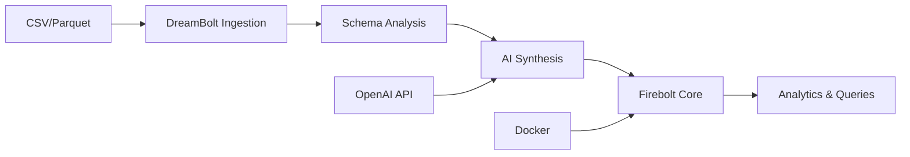

# 🚀 DreamBolt

**AI-powered data ingestion and synthesis pipeline with free Firebolt Core analytics.**

[](https://www.python.org/downloads/)
[](https://docs.firebolt.io/firebolt-core)
[](https://docs.docker.com/get-docker/)

DreamBolt transforms your CSV/Parquet data with AI-powered synthesis and loads it into **Firebolt Core** - a free, high-performance, self-hosted analytics engine. No cloud accounts or usage limits required!

## ✨ What's New: Firebolt Core Integration

🆓 **FREE**: No usage limits, no cloud accounts required  
🐳 **Self-hosted**: Runs locally with Docker  
🛢️ **PostgreSQL-compliant**: Familiar SQL interface  
📊 **High-performance**: Distributed query engine  
🔄 **Production-ready**: From laptop to enterprise clusters  

## 🎯 Quick Start

### 1. Install & Setup

```bash
# Clone and install
git clone https://github.com/your-org/dreambolt.git
cd dreambolt
pip install -r requirements.txt

# Setup environment
cp env.template .env
# Edit .env with your OPENAI_API_KEY

# Setup free Firebolt Core (requires Docker)
python -m cli firebolt setup
```

### 2. Your First Pipeline

```bash
# Ingest CSV with AI synthesis
python -m cli ingest WorldCupPlayers.csv --synthesize 100

# Query your enhanced data
python -m cli firebolt query "SELECT name, score FROM dreambolt.worldcupplayers ORDER BY score DESC LIMIT 10"
```

### 3. Advanced Usage

```bash
# With embeddings and custom model
python -m cli ingest data.csv \
  --synthesize 200 \
  --model openai:gpt-4 \
  --embed text-embedding-3-small

# Custom table name and no-synthesis mode
python -m cli ingest s3://bucket/data.parquet \
  --table my_analytics_table \
  --no-synth
```

## 📊 Architecture Overview



**Pipeline Flow:**
1. **Ingest**: Load and analyze CSV/Parquet data
2. **Clean**: Standardize schema and optimize data types  
3. **Synthesize**: Generate synthetic rows using LLMs (optional)
4. **Enhance**: Add embeddings for vector analytics (optional)
5. **Load**: Store in Firebolt Core for high-performance queries

## 🔥 Firebolt Core Commands

```bash
# Setup free Firebolt Core
python -m cli firebolt setup

# Check status
python -m cli firebolt status

# Execute SQL queries  
python -m cli firebolt query "SELECT COUNT(*) FROM dreambolt.my_table"

# Save query results
python -m cli firebolt query "SELECT * FROM dreambolt.users" --output results.csv

# Stop Firebolt Core
python -m cli firebolt stop
```

## 🔧 Configuration Options

### Firebolt Modes

**Option 1: Firebolt Core (Recommended - FREE)**
```bash
# In .env file
FIREBOLT_USE_CORE=true
FIREBOLT_CORE_PORT=5432
```

**Option 2: Managed Firebolt (Cloud)**  
```bash
# In .env file
FIREBOLT_USE_CORE=false
FIREBOLT_USERNAME=your-username@company.com
FIREBOLT_PASSWORD=your-password
FIREBOLT_ACCOUNT_NAME=your-account
```

### LLM Configuration

```bash
# OpenAI (recommended)
OPENAI_API_KEY=sk-your-key-here

# HuggingFace (local models)
HUGGINGFACE_TOKEN=hf_your-token-here
```

## 📚 Example Workflows

### Data Scientists
```bash
# Quick exploration with synthetic data
python -m cli ingest survey_data.csv --synthesize 500
python -m cli firebolt query "SELECT age, AVG(satisfaction) FROM dreambolt.survey_data GROUP BY age"
```

### Analytics Teams  
```bash
# Production ETL with embeddings
python -m cli ingest customer_reviews.csv \
  --synthesize 1000 \
  --embed text-embedding-3-small \
  --table customer_analytics

# Complex analytics queries
python -m cli firebolt query "
  SELECT 
    sentiment,
    AVG(rating) as avg_rating,
    COUNT(*) as review_count
  FROM dreambolt.customer_analytics 
  GROUP BY sentiment
  ORDER BY avg_rating DESC
"
```

### ML Engineers
```bash
# Create training datasets with embeddings
python -m cli ingest training_data.parquet \
  --synthesize 10000 \
  --embed all-MiniLM-L6-v2 \
  --table ml_training_set

# Export for model training  
python -m cli firebolt query "
  SELECT features, embeddings, target 
  FROM dreambolt.ml_training_set 
  WHERE split = 'train'
" --output train_dataset.csv
```

## 🧪 Testing & Development

```bash
# Run test suite
pytest -v

# Check component status
python -m cli status

# Test Firebolt Core specifically
python -m cli firebolt status

# Development mode with verbose logging
python -m cli ingest data.csv --verbose --dry-run
```

## 🚀 Deployment

### Local Development
- **Requirements**: Docker, Python 3.13+, 4GB RAM
- **Setup time**: ~2 minutes
- **Data limit**: None (limited by disk space)

### Production
- **Scaling**: Multi-node Firebolt Core clusters
- **Monitoring**: Built-in query performance metrics
- **Security**: Self-hosted = full data control

## 📖 Documentation

- **[Firebolt Core Docs](https://docs.firebolt.io/firebolt-core)** - Official documentation
- **[CLI Reference](#cli-reference)** - Complete command documentation  
- **[Architecture Guide](docs/ARCHITECTURE.md)** - System design details
- **[Custom Steps](docs/custom_steps.md)** - Extend the pipeline

## 🤝 Contributing

DreamBolt is open source! Contributions welcome:

```bash
# Development setup
git clone https://github.com/your-org/dreambolt.git
cd dreambolt
pip install -r requirements.txt
python -m cli firebolt setup

# Run tests
pytest tests/ -v

# Submit PR with:
# - Tests for new features  
# - Updated documentation
# - Firebolt Core compatibility
```

## 📄 License

MIT License - see [LICENSE](LICENSE) for details.

## 🙋 Support

- **Issues**: [GitHub Issues](https://github.com/your-org/dreambolt/issues)
- **Discussions**: [GitHub Discussions](https://github.com/your-org/dreambolt/discussions)
- **Firebolt Core**: [Community Support](https://github.com/firebolt-db/firebolt-core/discussions)

---

**⭐ Star this repo if DreamBolt helps your data workflows!**

# ⬇️ COMMIT SUGGESTION: git add -A && git commit -m "docs: add comprehensive README with vibe-coding workflow" 