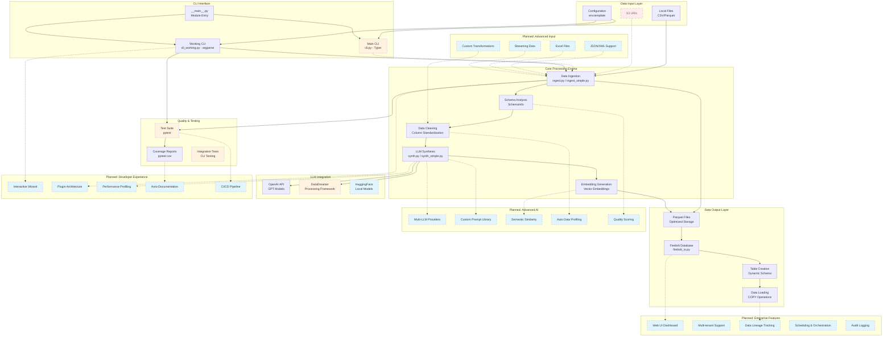

# 🏗️ DreamBolt Architecture Overview

**Last Updated:** 2025-06-20  
**Version:** v0.1 MVP + Future Roadmap  
**Status:** ✅ Core pipeline functional

## 📊 High-Level Architecture

## 🔍 Component Status Legend

| Symbol | Status | Description |
|--------|--------|-------------|
| **Solid** | ✅ Implemented | Fully functional and tested |
| **Dashed** | 🚧 Planned | In roadmap, not yet implemented |
| **Dot-dash** | ⚡ Partial | Partially implemented or has limitations |
| **Long-dash** | ❌ Disabled | Temporarily disabled or broken |

## 📋 Current Architecture Details

### ✅ **Implemented Components**

#### **Data Input Layer**
- **Local Files**: Full CSV/Parquet support with schema inference
- **Configuration**: Environment template with credential management

#### **CLI Interface** 
- **Working CLI** (`cli_working.py`): Argparse-based, fully functional
- **Module Entry** (`__main__.py`): Python module execution support

#### **Core Processing Engine**
- **Data Ingestion**: Multi-format loading with simplified fallbacks
- **Schema Analysis**: Automatic type detection and categorical inference  
- **Data Cleaning**: Column standardization and optimization
- **Parquet Output**: Optimized storage with embedding support

#### **Database Integration**
- **Firebolt Connection**: Engine management and table operations
- **Dynamic Schema**: Auto-generated CREATE TABLE statements
- **Data Loading**: Bulk COPY operations and fallback INSERT

### ⚡ **Partially Implemented**

#### **CLI Interface**
- **Main CLI** (`cli.py`): Typer-based but has Python 3.13 compatibility issues
- **Rich UI**: Progress bars working, but limited by typer issues

#### **LLM Integration**
- **LLM Synthesis**: Statistical fallback when DataDreamer unavailable
- **DataDreamer**: Manual installation required, not in requirements.txt

#### **Testing Framework**
- **Test Suite**: Structure exists but most tests skipped with TODOs
- **Integration Tests**: CLI testing framework setup but needs implementation

### ❌ **Currently Disabled**

#### **S3 Integration**
- **S3 URIs**: Temporarily disabled due to dependency issues
- **Reason**: boto3/s3fs import conflicts in simplified modules

## 🚀 **Planned Features Roadmap**

### **Phase 1: Foundation Completion**
- ✅ Core ingestion pipeline (DONE)
- 🚧 Complete test suite implementation
- 🚧 Fix typer/Python 3.13 compatibility
- 🚧 Re-enable S3 support with proper error handling

### **Phase 2: Advanced Data Processing**
- 🚧 JSON/XML/Excel format support
- 🚧 Streaming ingestion for large datasets  
- 🚧 Custom transformation pipelines
- 🚧 Data quality scoring and alerts

### **Phase 3: Enterprise Features**
- 🚧 Web UI dashboard for pipeline monitoring
- 🚧 Multi-tenant data isolation
- 🚧 Data lineage tracking
- 🚧 Scheduling and orchestration
- 🚧 Audit logging and compliance

### **Phase 4: Advanced AI & ML**
- 🚧 Multi-LLM provider support (Anthropic, local models)
- 🚧 Advanced prompt template library
- 🚧 Semantic similarity matching
- 🚧 Automated data profiling and insights
- 🚧 Custom embedding models

### **Phase 5: Developer Experience**
- 🚧 Interactive CLI wizard mode
- 🚧 Plugin architecture for custom steps
- 🚧 Performance profiling tools
- 🚧 Auto-documentation generation
- 🚧 Complete CI/CD pipeline

## 🔄 Data Flow Architecture

### **Current Pipeline**
1. **Input** → Local CSV/Parquet files
2. **Ingestion** → Schema analysis and data loading
3. **Processing** → Column cleaning and type optimization
4. **Synthesis** → Optional LLM-generated rows (fallback mode)
5. **Embeddings** → Optional vector generation for search
6. **Output** → Parquet files with standardized schema
7. **Loading** → Firebolt table creation and data copy

### **Error Handling Strategy**
- **Graceful Degradation**: Fallback modes when external services unavailable
- **Simulation Mode**: Mock operations for development/testing
- **Clear Messaging**: User-friendly error messages with troubleshooting steps

### **Configuration Management**
- **Environment Variables**: Centralized credential management
- **Template System**: `env.template` for easy setup
- **Validation**: Runtime checks for required configurations

## 🛠️ Technical Architecture Decisions

### **Module Design Principles**
- **<200 LOC per file**: Maintainable, focused modules
- **Simplified Fallbacks**: `*_simple.py` versions bypass complex dependencies
- **Rich Documentation**: Comprehensive docstrings and type hints
- **Smoke Tests**: Built-in testing with `if __name__ == "__main__"`

### **Dependency Strategy**
- **Core Dependencies**: pandas, pyarrow for data processing
- **Optional Dependencies**: Graceful handling of missing LLM/cloud libraries
- **Version Pinning**: Upper bounds for stability, lower bounds for features

### **Testing Philosophy**
- **Integration-First**: Test real workflows over unit tests
- **CLI Testing**: End-to-end command validation
- **Mock External APIs**: Avoid API costs in CI/CD

## 🔧 Development Workflow

### **Vibe-Coding Principles**
1. **Plan** → Update PLAN.md with feature
2. **Test** → Write failing tests first  
3. **Code** → Implement until tests pass
4. **Commit** → Atomic commits with clear messages

### **Quality Gates**
- **File Size**: Maximum 200 LOC per module
- **Test Coverage**: Integration tests for all major workflows
- **Documentation**: Self-documenting code with examples

---

*This architecture evolves with the codebase. Last synchronized: Repository audit and CLI fixes completed.* 