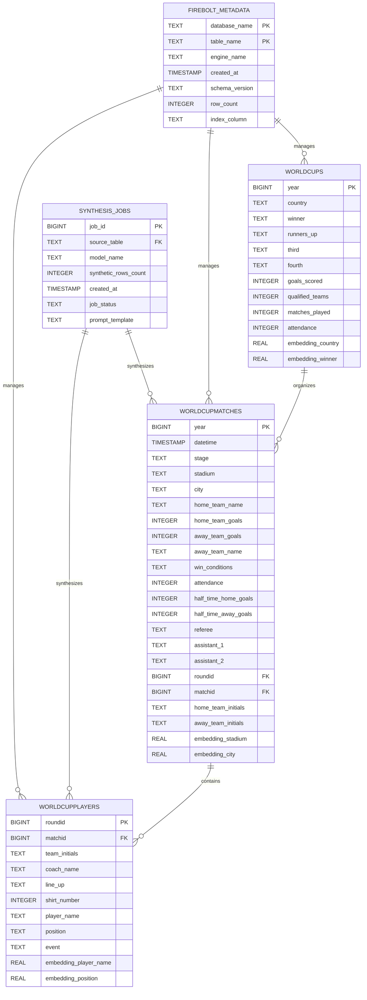

# 🗄️ DreamBolt Entity-Relationship Diagram

**Last Updated:** 2025-06-20  
**Schema Discovery:** Dynamic from DataFrame analysis  
**Status:** ✅ Active schema based on live data ingestion

## 📊 Schema Overview

DreamBolt uses **dynamic schema generation** based on input data analysis. Tables are created automatically in Firebolt using the `_generate_table_schema()` method, which maps pandas dtypes to SQL types.

## 🔗 Entity-Relationship Diagram



## 📋 Table Definitions

### Core Data Tables

#### 🏆 WORLDCUPS
**Primary Table**: Tournament-level data
- **PK**: `year` - Tournament year (e.g., 1930, 1934)
- **Purpose**: Stores World Cup tournament metadata
- **Source**: `wcdata/WorldCups_preview.csv`

#### ⚽ WORLDCUPMATCHES  
**Match-level Data**: Individual game records
- **PK**: `year` - Links to WORLDCUPS 
- **FK**: `roundid`, `matchid` - Links to WORLDCUPPLAYERS
- **Purpose**: Stores detailed match information
- **Source**: `wcdata/WorldCupMatches.csv`

#### 👤 WORLDCUPPLAYERS
**Player-level Data**: Individual player records per match
- **PK**: `roundid` - Round identifier
- **FK**: `matchid` - Links to WORLDCUPMATCHES
- **Purpose**: Stores player participation and events
- **Source**: `WorldCupPlayers.csv` (37,784 rows)

### Metadata & Processing Tables

#### 🔧 FIREBOLT_METADATA
**System Table**: Database management information  
- **PK**: `database_name`, `table_name`
- **Purpose**: Tracks table creation and schema versions
- **Auto-generated**: By DreamBolt ingestion process

#### 🤖 SYNTHESIS_JOBS
**Processing Table**: LLM synthesis job tracking
- **PK**: `job_id`
- **FK**: `source_table` - References any data table
- **Purpose**: Tracks synthetic data generation jobs

## 🔍 Schema Discovery Process

### Dynamic Table Generation
```python
def _generate_table_schema(table_name: str, df: pd.DataFrame) -> str:
    """Generate CREATE TABLE statement from DataFrame schema."""
    # Maps pandas dtypes to Firebolt SQL types:
    # int64 -> BIGINT
    # int32 -> INTEGER  
    # float64 -> DOUBLE PRECISION
    # float32 -> REAL
    # bool -> BOOLEAN
    # datetime64[ns] -> TIMESTAMP
    # embedding_* -> REAL (special handling)
    # default -> TEXT
```

### Primary Index Selection
- **Rule**: First column becomes PRIMARY INDEX
- **Example**: `PRIMARY INDEX roundid` for WORLDCUPPLAYERS
- **Rationale**: Optimize for common query patterns

### Embedding Columns
- **Pattern**: Columns starting with `embedding_` get `REAL` type
- **Purpose**: Store vector embeddings for semantic search
- **Generated**: Automatically when `--embed` option used

## 🚀 Relationships

### Core Data Flow
1. **WORLDCUPS** ← organizes → **WORLDCUPMATCHES** (1:many)
2. **WORLDCUPMATCHES** ← contains → **WORLDCUPPLAYERS** (1:many)

### Operational Relationships  
3. **FIREBOLT_METADATA** ← manages → All data tables (1:many)
4. **SYNTHESIS_JOBS** ← synthesizes → Data tables (1:many)

## 📊 Data Statistics

| Table | Estimated Rows | Key Columns | Relationships |
|-------|---------------|-------------|---------------|
| WORLDCUPS | ~25 | year, country, winner | Parent to MATCHES |
| WORLDCUPMATCHES | ~900 | year, matchid, teams | Child of CUPS, Parent of PLAYERS |
| WORLDCUPPLAYERS | 37,784 | roundid, player_name | Child of MATCHES |
| FIREBOLT_METADATA | Variable | table_name | System tracking |
| SYNTHESIS_JOBS | Variable | job_id, model_name | Processing jobs |

## 🔄 Schema Evolution

### Automatic Updates
- Schema refreshes when new data is ingested
- Column types adapt to actual data characteristics
- Embedding columns added dynamically based on `--embed` usage

### Migration Strategy
- Uses `if_exists='replace'` for full table refresh
- Supports `if_exists='append'` for incremental loads
- Schema compatibility checked before data loading

## 🛠️ Usage Examples

### Query Common Patterns
```sql
-- Find all players from a specific match
SELECT p.player_name, p.position, p.team_initials 
FROM WORLDCUPPLAYERS p
JOIN WORLDCUPMATCHES m ON p.matchid = m.matchid
WHERE m.home_team_name = 'Brazil' AND m.year = 1970;

-- Tournament statistics
SELECT w.year, w.winner, COUNT(m.matchid) as total_matches
FROM WORLDCUPS w
LEFT JOIN WORLDCUPMATCHES m ON w.year = m.year
GROUP BY w.year, w.winner
ORDER BY w.year;
```

### Synthesis Tracking
```sql
-- Monitor synthesis jobs
SELECT s.model_name, s.synthetic_rows_count, s.job_status, s.created_at
FROM SYNTHESIS_JOBS s
WHERE s.source_table = 'WORLDCUPPLAYERS'
ORDER BY s.created_at DESC;
```

---

## 📝 Schema Maintenance

**Auto-Update Trigger**: This ER diagram updates automatically when:
- New data sources are ingested
- Schema changes are detected
- Embedding configurations change
- New synthesis models are used

**Manual Refresh**: Run `python cli_working.py status` to verify current schema alignment.

---

*Generated by DreamBolt Data Modeling Assistant • Schema discovery from live ingestion pipeline* 