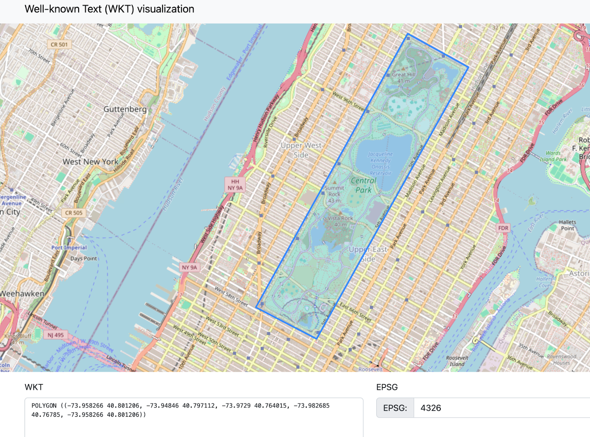
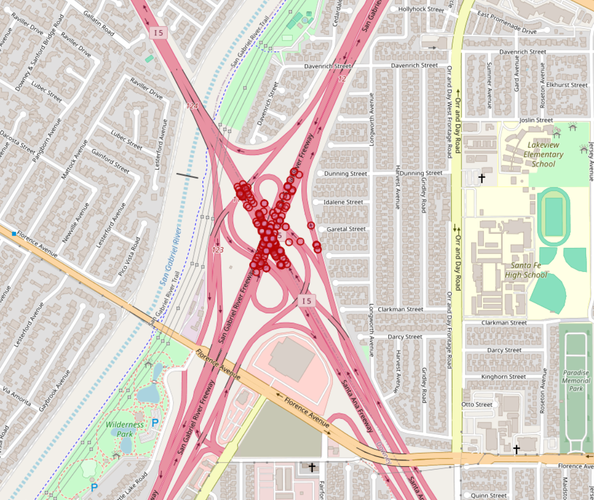

# Geography Data Type for Geospatial Analytics

## Analyzing this dataset
[US-Accidents Dataset (2016 to 2023)](https://www.kaggle.com/datasets/sobhanmoosavi/us-accidents)

### Steps to follow:
- Upload the dataset to the S3 bucket
- Sign up at [Firebolt](https://go.firebolt.io/signup) (comes with free credits)
- Create an engine; a Firebolt engine with a single S node is more
than good enough
- Create a database and name it `geospatial_test` (or anything you
love)
- Create an external table, followed by transforming it into an
internal structured table for analytical queries
- Use the [GeoJSON.io](https://geojson.io/) tool to visualize

## Geospatial analytics in action

This document will contain a step-by-step query workflow for Central
Park accident analysis.

### Dataset overview
- The analysis uses the **US-Accidents Dataset** from Kaggle.
- Covers data in 49 US states from February 2016 to March 2023.
- Contains approximately 7.7 million records collected from multiple
APIs broadcasting real-time traffic incident data.
- These APIs capture data from various entities, such as
transportation departments, law enforcement, traffic cameras, and
sensors.

#### Acknowledgments
- Moosavi, Sobhan, et al. "A Countrywide Traffic Accident Dataset." 2019.
- Moosavi, Sobhan, et al. "Accident Risk Prediction based on
Heterogeneous Sparse Data: New Dataset and Insights." ACM SIGSPATIAL, 2019.
- Dataset is available under **CC BY-NC-SA 4.0** license.

## Create database and tables

### 1. Creating an external table (`accidentdata_ext`)

- The `CREATE EXTERNAL TABLE` statement defines a schema that maps to
CSV files stored in an S3 bucket.
- Each column corresponds to an attribute from the dataset, including
accident metadata (e.g., severity, location, weather conditions, road
features).
- The URL parameter links the table to a public dataset stored in S3
(firebolt-sample-datasets-public-us-east-1).

#### Important configurations:
- `OBJECT_PATTERN = '*.csv'` ensures all CSV files in the directory
are included.
- `SKIP_HEADER_ROWS = TRUE` skips the first row, assuming it contains
column headers.
- `ALLOW_SINGLE_QUOTES = False` enforces strict parsing rules.

```sql
CREATE DATABASE geospatial_test;

CREATE EXTERNAL TABLE accidentdata_ext (
  id TEXT NULL,
  source TEXT NULL,
  severity BIGINT NULL,
  start_time TIMESTAMP NULL,
  end_time TIMESTAMP NULL,
  start_lat DOUBLE PRECISION NULL,
  start_lng DOUBLE PRECISION NULL,
  end_lat DOUBLE PRECISION NULL,
  end_lng DOUBLE PRECISION NULL,
  distance_mi DOUBLE PRECISION NULL,
  description TEXT NULL,
  street TEXT NULL,
  city TEXT NULL,
  county TEXT NULL,
  state TEXT NULL,
  zipcode TEXT NULL,
  country TEXT NULL,
  timezone TEXT NULL,
  airport_code TEXT NULL,
  weather_timestamp TIMESTAMP NULL,
  temperature_f DOUBLE PRECISION NULL,
  wind_chill_f DOUBLE PRECISION NULL,
  humidity_percentage DOUBLE PRECISION NULL,
  pressure_in DOUBLE PRECISION NULL,
  visibility_mi DOUBLE PRECISION NULL,
  wind_direction TEXT NULL,
  wind_speed_mph DOUBLE PRECISION NULL,
  precipitation_in DOUBLE PRECISION NULL,
  weather_condition TEXT NULL,
  amenity BOOLEAN NULL,
  bump BOOLEAN NULL,
  crossing BOOLEAN NULL,
  give_way BOOLEAN NULL,
  junction BOOLEAN NULL,
  no_exit BOOLEAN NULL,
  railway BOOLEAN NULL,
  roundabout BOOLEAN NULL,
  station BOOLEAN NULL,
  stop BOOLEAN NULL,
  traffic_calming BOOLEAN NULL,
  traffic_signal BOOLEAN NULL,
  turning_loop BOOLEAN NULL,
  sunrise_sunset TEXT NULL,
  civil_twilight TEXT NULL,
  nautical_twilight TEXT NULL,
  astronomical_twilight TEXT NULL
) 
URL = 's3://firebolt-sample-datasets-public-us-east-1/us-accidents-data/' 
OBJECT_PATTERN = '*.csv' 
TYPE = (CSV SKIP_HEADER_ROWS = TRUE ALLOW_SINGLE_QUOTES = FALSE);
```

### 2. Creating an internal table (`accidentdata`)

Once the external table is defined, the next step is to create an
internal Firebolt table for efficient querying.

Option 1: Explicit column order
- `CREATE TABLE accidentdata AS SELECT ... FROM accidentdata_ext`
- This approach manually selects all columns and explicitly
transforms `start_lat/lng` and `end_lat/lng` into geospatial points
using `ST_GeogPoint()`.
- Benefit: Preserves column order and maintains structured geospatial
fields.

Option 2: Quick transformation
- Uses `SELECT * EXCLUDE(start_lat, start_lng, end_lat, end_lng)`,
reducing verbosity.
- Geospatial transformations (`ST_GeogPoint`) are added at the end.
- Trade-off: The order of columns is slightly altered, but the approach is cleaner.

We went with option 1, but both are provided in the SQL scripts in
this repo.

#### Option 1: Explicit column order

```sql
CREATE TABLE accidentdata AS
SELECT
  id,
  source,
  severity,
  start_time,
  end_time,
  ST_GeogPoint(start_lng, start_lat) AS start_location,
  ST_GeogPoint(end_lng, end_lat) AS end_location,
  distance_mi,
  description,
  street,
  city,
  county,
  state,
  zipcode,
  country,
  timezone,
  airport_code,
  weather_timestamp,
  temperature_f,
  wind_chill_f,
  humidity_percentage,
  pressure_in,
  visibility_mi,
  wind_direction,
  wind_speed_mph,
  precipitation_in,
  weather_condition,
  amenity,
  bump,
  crossing,
  give_way,
  junction,
  no_exit,
  railway,
  roundabout,
  station,
  stop,
  traffic_calming,
  traffic_signal,
  turning_loop,
  sunrise_sunset,
  civil_twilight,
  nautical_twilight,
  astronomical_twilight
FROM accidentdata_ext;
```

### 3. Verifying data integrity
```sql
SELECT COUNT(*) FROM accidentdata_ext;
SELECT COUNT(*) FROM accidentdata;
```

Both queries return **7,728,394** rows, ensuring data integrity
between external and internal tables.

**Ok, so now we have the data and everything setup the way it should
be, let’s begin!**

## Begin Analysis

### 1. Let's define a polygon for Central Park

Query:
```sql
SET query_parameters={"name":"central_park","value":"POLYGON((-73.95826578140259 40.80120581546623,-73.94845962524414 40.79711243898632,-73.97289991378783 40.76401504612403,-73.98268461227417 40.76785044388771,-73.95826578140259 40.80120581546623))"};
```

- In this query, we show a polygon representing the Central Park area
in New York City is using the **Well-Known Text (WKT)** format.
- The polygon coordinates encapsulate the boundaries of Central Park.
- This step sets the polygon as a query parameter named
`central_park`, enabling its reuse across multiple queries for
geographic filtering.

Output:


### 2. Now, let's count accidents by year within Central Park
```sql
SELECT EXTRACT(YEAR FROM start_time) AS year, COUNT(*)
FROM accidentdata
WHERE ST_COVERS(ST_GeogFromText(param('central_park')), start_location)
GROUP BY ALL
ORDER BY year;
```

- This query calculates the number of accidents occurring inside Central Park for each year.
- The `st_covers` function checks if the accident's location
(`start_location`) lies within the Central Park polygon (`st_geogfromtext(param('central_park'))`).
- The `extract(year from start_time)` function groups the accidents
by year, enabling trend analysis.
- The result provides a temporal view of accidents, helping to
identify years with higher or lower accident counts.

### 3. Retrieve accident points within Central Park

Query:
```sql
SELECT ST_AsText(start_location)
FROM accidentdata
WHERE ST_COVERS(ST_GeogFromText(param('central_park')), start_location);
```

- This query extracts the geographic coordinates of all accidents
that occurred within Central Park.
- The `st_covers` function determines if one `GEOGRAPHY` object fully
encompasses another. Specifically, it checks whether every point in
the second `GEOGRAPHY` object (`geo2`) lies within or on the boundary
of the first `GEOGRAPHY` object (`geo1`). You can read
[our documentation](https://docs.firebolt.io/sql_reference/functions-reference/geospatial/)
for more information.
- The `st_astext` function converts the accident location
(`start_location`) into a human-readable WKT format.
- This step provides granular accident location data for further
spatial analysis or visualization.

### 4. New scenario: Where are accidents most frequent in the US?

Query:
```sql
SELECT ST_S2CellIDFromPoint(start_location, 15), COUNT(*) AS c
FROM accidentdata
GROUP BY ALL
ORDER BY c DESC;
```

This result tells us that most accidents occur in **S2 cell id:
-9168534571950538752**

### 5. Let's find all accidents in that cell ID

Query:
```sql
SELECT 'GEOMETRYCOLLECTION(' || ARRAY_TO_STRING(ARRAY_AGG(ST_AsText(start_location)), ',') || ')' 
FROM accidentdata 
WHERE ST_S2CellIDFromPoint(start_location, 15) = -9168534571950538752;
```

And we find that the cell with the most accidents is at the I5-I605
interchange just southeast of downtown LA.
